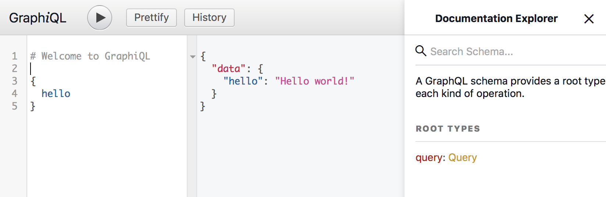
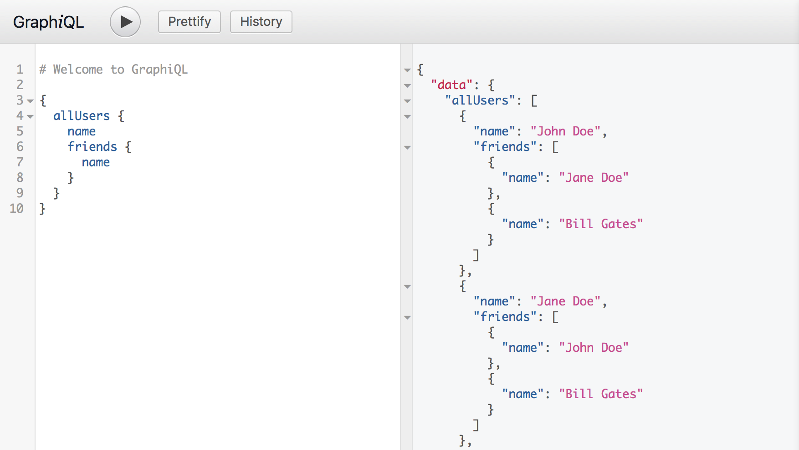
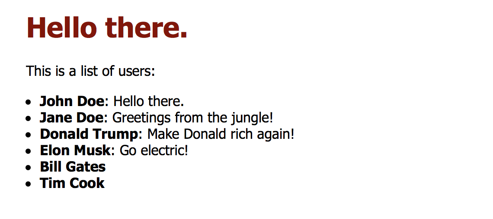

# Intro to GraphQL
Hello and welcome 👋 

This is a meetup talk by me. If you’re attending the meetup, good for you. If you’ve stumbled upon this repo somehow, welcome and help yourself out. 

> To view the slides:

```
npm install
npm start
```

> Or go here: [matusmarcin.com/graphql/](https://www.matusmarcin.com/graphql/)

In the end this is a fairly simple example of how GraphQL server can be built on top of REST API and used in a client React.js app. It is accompanied by four other repos. In the hindsight, I could’ve just used folders inside of one repo but I also wanted examples that would make sense as a standalone tiny projects.

* [GraphQL Hello World example](https://github.com/matusmarcin/graphql-hello-world)
* [GraphQL Server built with Express](https://github.com/matusmarcin/graphql-express-example)
* [REST API in Node.js](https://github.com/matusmarcin/node-express-static)
* [Client app in React.js](https://github.com/matusmarcin/graphql-react-client)

### What will happen now?

In this session I try to cover what is GraphQL, why is it useful, where to use it and most importantly, how. You should see a very simple but complete example of how GraphQL server can be built on top of REST API and used in a client React.js app with Relay Modern. 

I expect the average listener to at best be experienced with Javascript and/or have good understanding of some other reasonable programming language. Feel free to ask at any point. However I don’t intend to be covering JS or ES6 syntax.

## What is GraphQL?
Okay, let’s start at the start.

### What is?

> GraphQL is a **query language for your API**, and a server-side runtime for executing queries by using a type system you define for your data. GraphQL isn't tied to any specific database or storage engine and is instead backed by your existing code and data. [[src](http://graphql.org/learn/)]  

For example the query:

```javascript
{
  me {
    name
  }
}
```

Could produce the JSON result:

```javascript
{
  "me": {
    "name": "Luke Skywalker"
  }
}
```

### Where is?

Here, **between** your client and (REST) API.


But you could also put it between your client**(s)** and **APIs, DBs, whatever** you have.


And that’s awesome.

## Why GraphQL?
So why GraphQL? I think motivation can be found in these three points:

1. Simple and self-descriptive way to query the data.
2. Only get what you need.
3. Even if it lives in multiple places.

## How GraphQL?
At this point you’re nodding in agreement and thinking: 
_“Okay, we’re sold (or we still have beer) so go on and tell us how to do this.”_

And I shall go do just that.

### Hello world!

Let’s take this super simple example [[repo](https://github.com/matusmarcin/graphql-hello-world), [original source](http://graphql.org/graphql-js/)]: 

```
npm init
npm install graphql --save
```

Create a `server.js`:

```javascript
var { graphql, buildSchema } = require('graphql');

// Construct a schema, using GraphQL schema language
var schema = buildSchema(`
  type Query {
    hello: String
  }
`);

// The root provides a resolver function for each API endpoint
var root = {
  hello: () => {
    return 'Hello world!';
  },
};

// Run the GraphQL query '{ hello }' and print out the response
graphql(schema, '{ hello }', root).then((response) => {
  console.log(response);
});
```

And now you can:

`node server.js`

Which should output:
 
```javascript
{ data: { hello: 'Hello world!' } }
```
 
🎉

Absolutely amazing and incredibly useless, you might say and I won’t disagree. This is not quite there yet, just a hello world. And those are rarely full-blown production ready codebases.

### Enter Express (and a couple more things)

Let’s take this [repo, specifically branch `1-hello`](https://github.com/matusmarcin/graphql-express-example/tree/1-hello):

```javascript
// Construct a schema, using GraphQL schema language
var schema = buildSchema(`
  type Query {
    hello: String
  }
`);

// The root provides a resolver function for each API endpoint
var root = {
  hello: () => {
    return 'Hello world!';
  },
};

var app = express();
app.use('/graphql', graphqlHTTP({
  schema: schema,
  rootValue: root,
  graphiql: true,
}));
app.listen(4000);
```


If you run the project with `node server` and navigate to [localhost:4000/grapqhl](http://localhost:4000/graphql) we can see Graph_i_QL which is a graphical interface to GraphQL. Three columns are for your query, response and docs (with our schema).



You can explore the docs and see that this very simple schema knows only one query `hello` and the response for it is the same as in the previous example.

Pretty much the same stuff, but now it looks much more usable (and extensible).

### Moving on from hello worlds (and connecting to REST API)

We’ll now attempt to connect our GraphQL to a REST API. 

So let’s fashion a simple one from [this repo](https://github.com/matusmarcin/node-express-static/).

Running `npm start` (after you’ve `npm i`-ed before) gets you one endpoint on [localhost:3000](http://localhost:3000/users/):

* `users`
* `users/{id}`

Where you can query all users or specific user by ID. Makes sense.


That’s cool and running so let’s slap a GraphQL on top of it [[same repo as before, different commit/branch](https://github.com/matusmarcin/graphql-express-example/tree/2-rest-api)].

This is the gist of it, in a separate `schema.js` file we’ve created along with some `fetch`  helper functions and GraphQL imports:

```javascript
const QueryType = new GraphQLObjectType({
  name: 'Query',
  description: 'The root of all... queries',
  fields: () => ({
    allUsers: {
      type: new GraphQLList(UserType),
      resolve: root => fetchUsers(),
    },
    user: {
      type: UserType,
      args: {
        id: { type: GraphQLInt },
      },
      resolve: (root, args) => fetchUserById(args.id),
    },
  }),
});

const UserType = new GraphQLObjectType({
  name: 'User',
  description: 'Somebody that you used to know',
  fields: () => ({
    name: {
      type: GraphQLString,
      resolve: user => user.name,
    },
    id: {type: GraphQLInt},
  }),
});

export default new GraphQLSchema({
  query: QueryType,
});
```

`npm start` and [localhost:4000/graphql](http://localhost:4000/graphql) gets you:


We now have two fields in our Query - `allUsers` and `user` with a parameter `id: Int`.

```javascript
{
  user(id: 2) {
    id
    name
  }
}
```

As you can see here, GraphQL supports parameters inside queries with a very reasonable syntax.

### Show me what you got

This is all nice, but we still have that array of friends which contains references to other users. This is were GraphQL can really shine. [[repo](https://github.com/matusmarcin/graphql-express-example/blob/3-friends/schema.js)]

We extend our `UserType` and add `friends` with a resolver.

```javascript
const UserType = new GraphQLObjectType({
  name: 'User',
  description: 'Somebody that you used to know',
  fields: () => ({
    name: {
      type: GraphQLString,
      resolve: user => user.name,
    },
    id: {type: GraphQLInt},
*    friends: {
*      type: new GraphQLList(UserType),
*      resolve: user => user.friends.map(fetchUserById)
*    },
  }),
});
```

We’ve already had `fetchUserById` defined - it returns a Promise with a user json. All the magic here is done by GraphQL and thanks to the types we have defined.

Now we can use this.



🎉

### Connecting more APIs

Let’s connect another API. It could be another REST, MongoDB, or essentially **anything asynchronous**. However I was a bit lazy and just went for filesystem. [[repo](https://github.com/matusmarcin/graphql-express-example/tree/4-more)]

```javascript
const UserType = new GraphQLObjectType({
  name: 'User',
  fields: () => ({
    name: { ... },
*    message: { 
*      type: GraphQLString,
*      resolve: user => getSomeRandomDataFromFile(),
*    },
    id: { ... },
    friends: { ... },
  }),
});
```

Just to give you an idea on how I wrapped the traditional assychronous callback `fs.writeFile` into a Promise:

```javascript
function getSomeRandomDataFromFile() {
  return new Promise(function(resolve, reject){
    fs.readFile('data.txt', 'utf8', (err, data) => {
        if (err) { reject(err); }
        resolve(data);
    })
  });
}
```

When querying for users with message field:

```javascript
{
  allUsers {
    name
    message
  }
}
```

We’re now getting:

```javascript
{
  "data": {
    "allUsers": [
      {
        "name": "John Doe",
        "message": "Hello everyone!"
      },
      {
        "name": "Jane Doe",
        "message": "Hello everyone!"
      },
		...
    ]
  }
}

```

I will go and make this a little more practical allowing us to specify a message for each user. [[repo](https://github.com/matusmarcin/graphql-express-example/tree/5-messages)]

I have created a structure where messages are read based on user’s first name (`user.name.toLowerCase().split(" ")[0]`):

```
 - [data]
	- donald.txt
	- elon.txt
	- john.txt
```

Resolver is slightly modified. And you can imagine (or look in the [repo](https://github.com/matusmarcin/graphql-express-example/tree/5-messages) to see) how the `getUserMessageFromFile()` might look.

```javascript
const UserType = new GraphQLObjectType({
  name: 'User',
  fields: () => ({
    name: { ... },
    message: { 
      type: GraphQLString,
*      resolve: user => getUserMessageFromFile(user.name.toLowerCase().split(" ")[0]),
    },
    id: { ... },
    friends: { ... },
  }),
});
```

That’s it. In case a file is non-existent, the message can be null:

```javascript
{
  "data": {
    "allUsers": [
      {
        "name": "John Doe",
        "message": "Hello there."
      },
      {
        "name": "Jane Doe",
        "message": null
      },
      {
        "name": "Donald Trump",
        "message": "Make Trump Rich Again!"
      },
      {
        "name": "Elon Musk",
        "message": "Go electric!"
      },
		...
    ]
  }
}
```

Alright, this is enough of a server. We can try build a client app.

## Client app
### React.js + Relay Modern

For the client app we’ll build a simple thing that shows a list of users.

The skeleton of the app with static data might look like this. [[repo](https://github.com/matusmarcin/graphql-react-client/tree/1-hardcoded)]

We have only two components at this point - `App` and `User`. 

(I admit, I could’ve added `UserList` from the beginning. Will do that later.)


Normally this kind of data might be coming from REST API and you’d be probably `fetch`ing it. We want to use GraphQL for this. Two client libraries that exists here are [Apollo](https://github.com/apollographql) and [Relay](https://facebook.github.io/relay/). I will go with Relay, because that’s where I have more experience but I am strongly suggesting you research which one fits you better. There’s [this article](https://medium.com/@codazeninc/choosing-a-graphql-client-apollo-vs-relay-9398dde5363a) that might be useful.

Note: There is Relay “Classic” and Relay modern. Relay Modern is the newer version so I went with that.

### Okay, React.js + Relay Modern for real now

We have to do a couple of things, really. Here they are in somewhat of an order:

1. Get the schema (copy for now, can be automated)
2. Install and import `react-relay`
3. Define our relay `Environment.js` [[src](https://facebook.github.io/relay/docs/relay-environment.html)]
4. Define queries in the React component files
5. Use  `QueryRenderer` at top level [[src](https://facebook.github.io/relay/docs/query-renderer.html)]

### First query

Not going to detail in all of these (since [repo is here](https://github.com/matusmarcin/graphql-react-client/tree/2-first-query)) here’s our `App.js`:

```javascript
import React, { Component } from 'react';
import {
  QueryRenderer,
  graphql
} from 'react-relay'
import environment from './Environment'
import User from './User';

const AppAllUsersQuery = graphql`
  query AppAllUsersQuery {
    user(id: "3") {
      id
      name
      message
    }
  }
`

class App extends Component {
  render() {
    return (
      <div>
        <h1>Hello there.</h1>
        <QueryRenderer
          environment={environment}
          query={AppAllUsersQuery}
          render={({error, props}) => {
            if (error) {
              return <div>{error.message}</div>
            } else if (props) {
              return <User {...props.user} />
            }
            return <div>Loading</div>
          }}
        />
      </div>
    );
  }
}
export default App;
```

As you can see, this covers 2., 4. and 5., and uses 3. Somehow, I just render one user here, but that could be easily changed in the `query` and `QueryRenderer`’s `render` prop.

Whenever you change the queries, you need to run:

`relay-compiler --src ./src --schema ./schema.graphql`

Or in my case:

`npm run relay`

And then `npm start` and we can see ([localhost:5000](http://localhost:5000)):


Hooray, we’ve connected our app with GraphQL!

🎉

### User list

Like I’ve mentioned, I forgot to create a `UserList` components so this is where I catch up.

I also just change the query in `App.js` to pull all users.

```javascript
const AppAllUsersQuery = graphql`
*  query AppAllUsersQuery {
*    allUsers {
*      id
*      name
*      message
*    }
  }
`
class App extends Component {
  render() {
    return (
      <div>
        <QueryRenderer
          environment={environment}
          query={AppAllUsersQuery}
          render={({error, props}) => {
				...
*             return <UserList users={props.allUsers} />
          }}
        />
      </div>
    );
  }
}
```

For a proof: [localhost:5000](http://localhost:5000).

### Fragments

Okay, we have one query defined at our top component but this is neither very practical nor scalable. 

We’re going to move to **collocated queries** and use **fragments** for that.

#### Wait, what’s a fragment?

Here:

```javascript
{
  allUsers {
    ...User_user
  }
}

fragment User_user on User {
  id
  name
  message
}
```

The first thing is a query which uses the fragment (the second thing). You know that reuse is a great thing and you can imagine how it might help if we only defined this fragment once and then used it on several occasions.

```javascript
query UserListQuery {
  allUsers {
    ...User_user
  }
}

query SpecificUserQuery {
  user(id: "2") {
    ...User_user
  }
}
```

#### How to use them?

```javascript
* import { createFragmentContainer, graphql } from 'react-relay';

class User extends Component {
  render() {
	...
  }
}
*export default createFragmentContainer(User, graphql`
*  fragment User_user on User {
*    id
*    name
*    message
*  }
*`)
```

We have wrapped our `User` with the `createFragmentContainer` . [[src](https://facebook.github.io/relay/docs/fragment-container.html)]

This way we can easily see what kind of data Relay will provide from GraphQL and we don’t really have to be worried about anything else here.

In the `UserList` component we have left:

```javascript
const AllUsersQuery = graphql`
query UserListQuery {
  allUsers {
    ...User_user
  }
}
`;
```

Plus the `QueryRenderer` part which I have moved from `App.js` here.

If the app still displays what it did before, we haven’t broken anything (yay!) only made our code better.



### Displaying friends

I have also added a feature that displays friends but that now seems really straightforward so I am not go into detail on that. You can find it in the [repo](https://github.com/matusmarcin/graphql-react-client/tree/5-friends).

## Back to GraphQL server
That’s all with the client for now. Let’s go back to the server part and play with that a bit more.

## Mutations (aka fancy POST)
And the last trick up my sleeve (I have only so many sleeves) is showing you **mutations** with GraphQL. This is truly, as my friends described it, just a fancy POST - a **way to modify server-side data**.

I am going to consider a mutation that changes the user message (specifying the ID and new message):

```javascript
mutation {
  changeUserMessage(id: "2", message: "Greetings from the jungle!") {
    id
    name
    message
  }
}
```

Notice I am asking for `name` along with `id` and `message` to be returned - since my mutation field `changeUserMessage` returns `UserType` object, I can do that.

The trickier part, unknown to us up until now is the `mutation`. 

> Most types in your schema will just be normal object types, but there are two types that are special within a schema:  

```
schema {
  query: Query
  mutation: Mutation
}
```

> Every GraphQL service _has a query_ type and _may or may not have a mutation_ type. These types are the same as a regular object type, but they are special because they define the _entry point_ of every GraphQL query. [[src](http://graphql.org/learn/schema/#the-query-and-mutation-types)]  

Okay, so it’s an object type we need to define, with it’s fields and resolvers. It just happens to be an entry point of the schema along with `query`.

### Implement a mutation

Here we go, our extended `schema.js`: [[repo](https://github.com/matusmarcin/graphql-express-example/tree/6-mutations)]

```javascript
const MutationType = new GraphQLObjectType({
  name: 'Mutation',
  fields: () => ({
    changeUserMessage: {
      type: UserType,
      args: {
        id: { type: new GraphQLNonNull(GraphQLString) },
        message: { type: new GraphQLNonNull(GraphQLString) },
      },
      resolve: (parentValue, args) => saveUserMessage(args.id, args.message),
    }
  })
})

export default new GraphQLSchema({
  query: QueryType,
*  mutation: MutationType,
});
```

Except for having to add the `saveUserMessage` function — which in my case saves to file, or in general POSTs something to an API, or DB — this is all. 

We can execute the query above and rejoice from updated messages.

Query:

```javascript
mutation {
  changeUserMessage(id: "3", message: "Donald can't do GraphQL!") {
    id
    name
    message
  }
}
```

Response:

```javascript
{
  "data": {
    "changeUserMessage": {
      "id": "3",
      "name": "Donald Trump",
      "message": "Donald can't do GraphQL!"
    }
  }
```

### Bonus for live attendees

If you’re here and now (at the meetup) you can connect to my GraphQL server and update a message on a user you want. 

I’ll share a link with the query included so you don’t have to type much.

We can watch the messages update in our client app.

Have fun!

## That’s all.
👏

## Q&A?
🍻

## Stay in touch
E-mail me at: `/matus\.marcin@(gmail|globallogic)\.com/` or follow me [@faster](https://twitter.com/faster) or [github.com/matusmarcin](https://github.com/matusmarcin).

Thank you.

🙏

### Misc resources

I was too lazy to clean up what I’ve found so… Enjoy!

* Nice overview: [GraphQL Overview - Getting Started with GraphQL & Node.js](https://blog.risingstack.com/graphql-overview-getting-started-with-graphql-and-nodejs/)
* [Getting Started With GraphQL.js | GraphQL.js Tutorial](http://graphql.org/graphql-js/)
* GraphQL JS: [GitHub - graphql/graphql-js: A reference implementation of GraphQL for JavaScript](https://github.com/graphql/graphql-js)
* [GitHub - RisingStack/graphql-server: Example GraphQL server with Mongoose (MongoDB) and Node.js](https://github.com/RisingStack/graphql-server)
* Dataloader: How to fix  duplicate requests being made by GraphQL: [Wrapping a REST API in GraphQL | GraphQL](http://graphql.org/blog/rest-api-graphql-wrapper/)
* Relay vs Apollo: [Choosing a GraphQL Client: Apollo vs. Relay – Codazen – Medium](https://medium.com/@codazeninc/choosing-a-graphql-client-apollo-vs-relay-9398dde5363a)
* How to QueryRenderer better: [Getting Started with Relay “Modern” for Building Isomorphic Web Apps](https://hackernoon.com/getting-started-with-relay-modern-for-building-isomorphic-web-apps-ae049e4e23c1)

### Special special bonus

Our [Fabio spoke on GraphQL at React London Meetup in 2016](https://youtu.be/HrECWxWVcEI?t=59m5s), when we were building it for The Economist.
