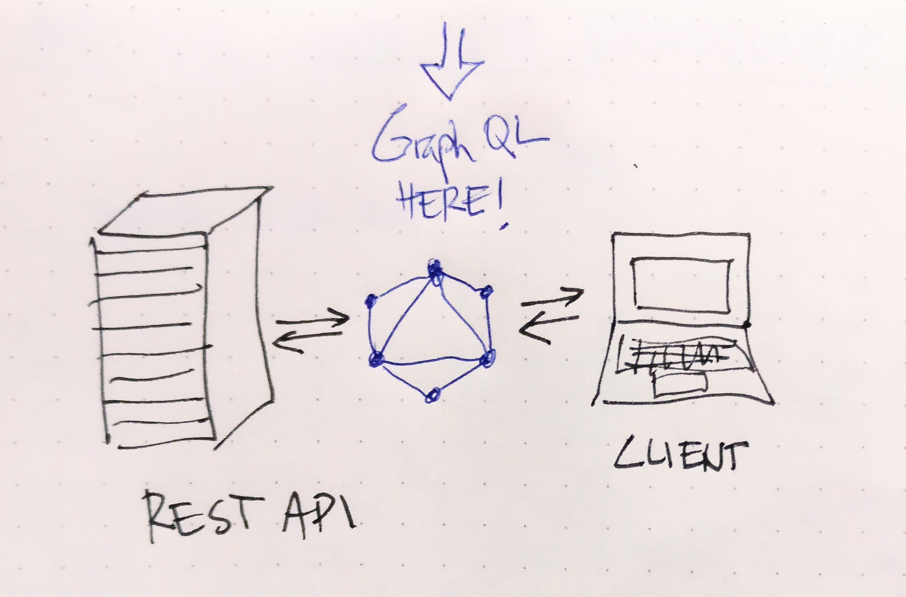
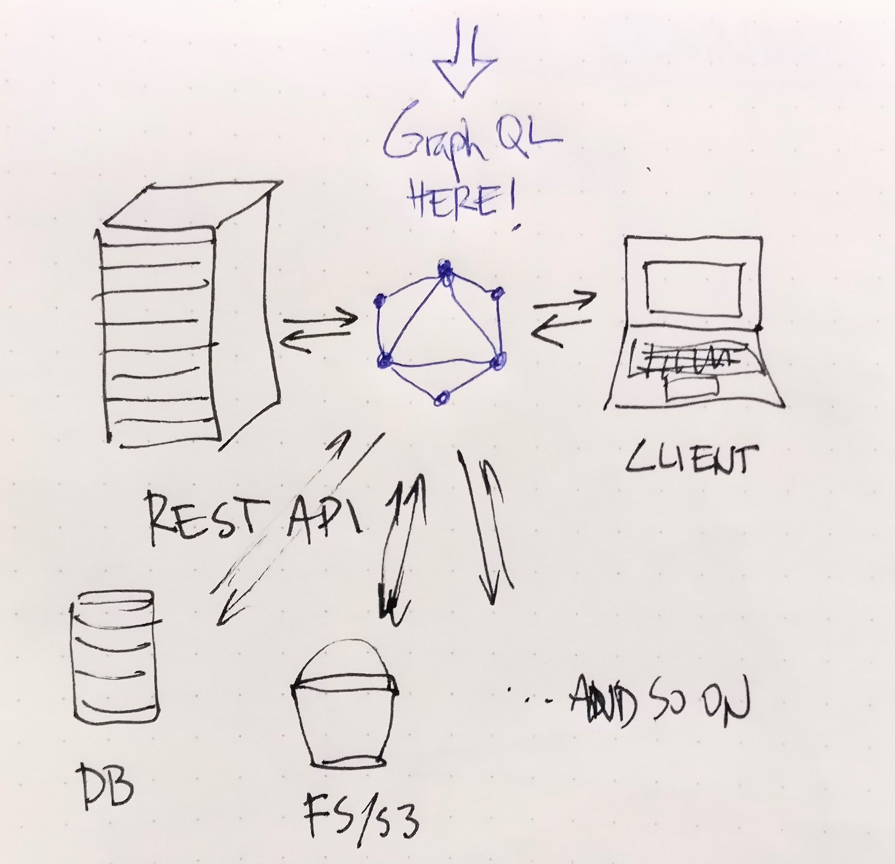
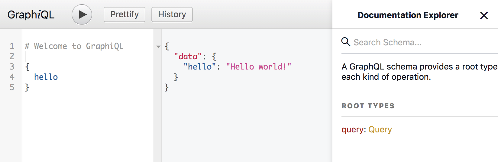
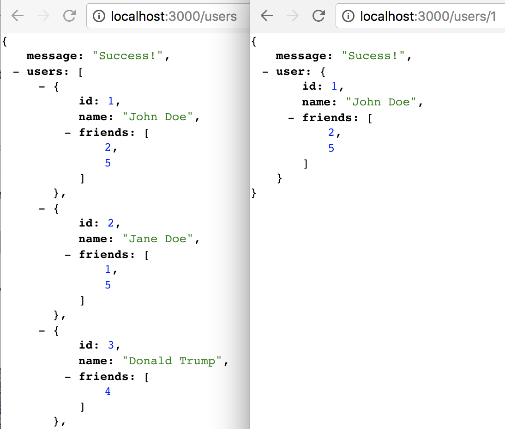
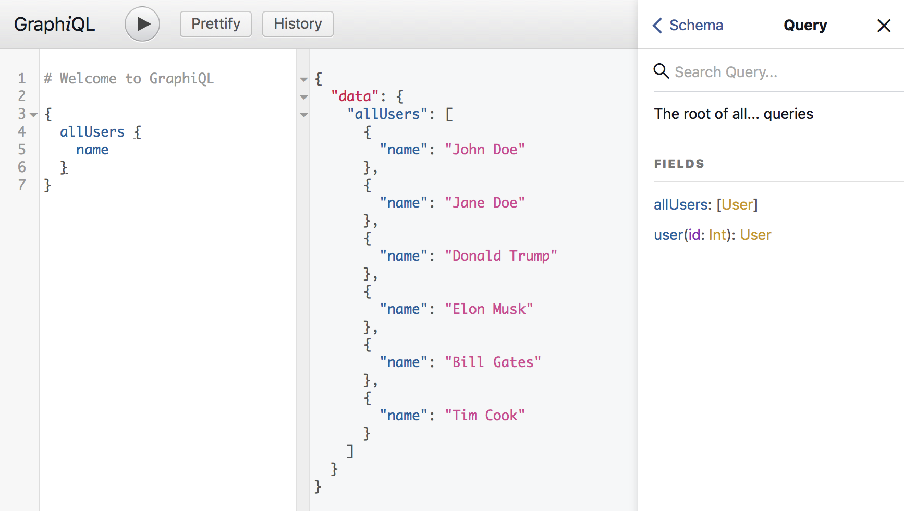
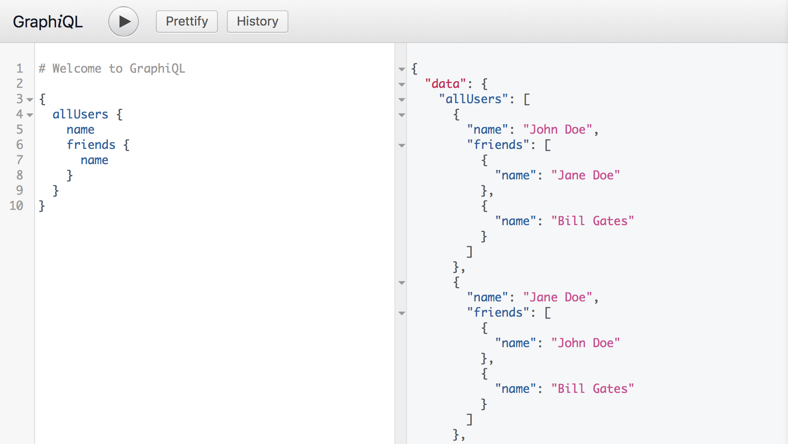
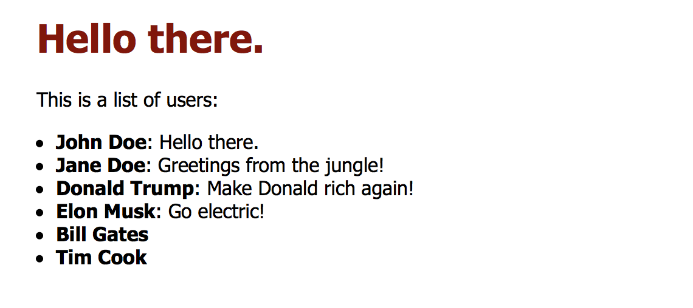

<!-- .slide: data-background="intro-slide.png" -->

---

# Intro to GraphQL
Hello and welcome 👋 

---

### What will happen now?

* What is GraphQL
* Why is it useful
* Where to use it
* and most importantly, how. 

---

### Expected outcome

A very simple but complete example of how GraphQL server can be built on top of REST API and used in a client React.js app with Relay Modern. 

Note: I expect the average listener to at best be experienced with Javascript and/or have good understanding of some other reasonable programming language. Feel free to ask at any point. However I don’t intend to be covering JS or ES6 syntax.

---

## What is GraphQL?
Okay, let’s start at the start.

---

### What is?

> GraphQL is a **query language for your API**, and a server-side runtime for executing queries by using a type system you define for your data. GraphQL isn't tied to any specific database or storage engine and is instead backed by your existing code and data. [[src](http://graphql.org/learn/)]  

---

For example the query:

```javascript
{
  me {
    name
  }
}
```

Could produce the JSON result:

```javascript
{
  "me": {
    "name": "Luke Skywalker"
  }
}
```

---

### Where is?



Note: Here, **between** your client and (REST) API.

---

### Where is?



Note: But you could also put it between your client**(s)** and **APIs, DBs, whatever** you have.

---

## Why GraphQL?

1. Simple and self-descriptive way to query the data.
2. Only get what you need.
3. Even if it lives in multiple places.

Note: So why GraphQL? I think motivation can be found in these three points.

---

## How GraphQL?

_“Okay, we’re sold (or we still have beer) so go on and tell us how to do this.”_

Note: At this point you’re nodding in agreement and thinking.. And I shall go do just that.

---

### Hello world!

Let’s take this super simple example: 

```
npm init
npm install graphql --save
```

---

### Create a `server.js`

```javascript
var { graphql, buildSchema } = require('graphql');
var schema = buildSchema(`
  type Query {
    hello: String
  }
`);
var root = {
  hello: () => {
    return 'Hello world!';
  },
};
graphql(schema, '{ hello }', root).then((response) => {
  console.log(response);
});
```

---

### Hello world! 🎉

And now you can run 

```
node server.js
```

Which should output:

```javascript
{ data: { hello: 'Hello world!' } }
```

Note: Absolutely amazing and incredibly useless, you might say and I won’t disagree. This is not quite there yet, just a hello world. And those are rarely full-blown production ready codebases.

---

### Enter Express
#### (And a couple more things)

* Let’s take my [`graphql-express-example`, branch `1-hello`](https://github.com/matusmarcin/graphql-express-example/tree/1-hello)...

---

### `server.js` part 1

```javascript
// Construct a schema, using GraphQL schema language
var schema = buildSchema(`
  type Query {
    hello: String
  }
`);

// The root provides a resolver function for each API endpoint
var root = {
  hello: () => {
    return 'Hello world!';
  },
};
```

---

### `server.js` part 2

```javascript
var app = express();

app.use('/graphql', graphqlHTTP({
  schema: schema,
  rootValue: root,
  graphiql: true,
}));

app.listen(4000);
```

---

### Run it

* Run the project with `node server`
* Navigate to [localhost:4000/grapqhl](http://localhost:4000/graphql)
* See GraphiQL which is a graphical interface to GraphQL.

---

### GraphiQL 🎉

* Columns are for your query, response and docs (with our schema).



Note: You can explore the docs and see that this very simple schema knows only one query `hello` and the response for it is the same as in the previous example. Pretty much the same stuff, but now it looks much more usable (and extensible).

---

### Moving on from hello worlds

#### (And connecting to REST API)

* We’ll now attempt to connect our GraphQL to a REST API. 
* Let’s fashion a simple one from my [`node-express-static`](https://github.com/matusmarcin/node-express-static/) example.

---

### We have REST

* Running `npm start` (after you’ve `npm i`-ed before) gets you this on [localhost:3000](http://localhost:3000/users/):
  * `users` 
  * `users/{id}`

---

### We have REST 🎉



---

### That’s cool

* Let’s put a GraphQL on top of it.
* Here follows a gist of it:
  * a separate `schema.js` file we’ve created 
  * some `fetch`  helper functions
  * GraphQL imports, of course

---

### Our `schema.js` part 1

```javascript
const QueryType = new GraphQLObjectType({
  name: 'Query',
  fields: () => ({
    allUsers: {
      type: new GraphQLList(UserType),
      resolve: root => fetchUsers(),
    },
    user: {
      type: UserType,
      args: {
        id: { type: GraphQLInt },
      },
      resolve: (root, args) => fetchUserById(args.id),
    },
  }),
});
```

---

### Our `schema.js` part 2

```javascript
const UserType = new GraphQLObjectType({
  name: 'User',
  fields: () => ({
    name: {
      type: GraphQLString,
      resolve: user => user.name,
    },
    id: {type: GraphQLInt},
  }),
});

export default new GraphQLSchema({
  query: QueryType,
});
```

---

### We have GraphQL on REST! 🎉

* `npm start` and [localhost:4000/graphql](http://localhost:4000/graphql) gets you:



Note: We now have two fields in our Query - `allUsers` and `user` with a parameter `id: Int`.

---

### The other query

```javascript
{
  user(id: 2) {
    id
    name
  }
}
```

Returns just a user by `id`, of course.

Note: As you can see here, GraphQL supports parameters inside queries with a very reasonable syntax.

---

### Show me what you got

Let's process `friends` too.

Note: This is all nice, but we still have that array of friends which contains references to other users. This is were GraphQL can really shine.

---

### Adding friends

We extend our `UserType` and add `friends` with a resolver.

```javascript
const UserType = new GraphQLObjectType({
  name: 'User',
  description: 'Somebody that you used to know',
  fields: () => ({
    name: {
      type: GraphQLString,
      resolve: user => user.name,
    },
    id: {type: GraphQLInt},
*    friends: {
*      type: new GraphQLList(UserType),
*      resolve: user => user.friends.map(fetchUserById)
*    },
  }),
});
```

Note: We’ve already had `fetchUserById` defined - it returns a Promise with a user json. All the magic here is done by GraphQL and thanks to the types we have defined.

---

### We have friends! 🎉



---

### Connecting more APIs

Let’s connect another API. Essentially **anything asynchronous**.

Note: It could be another REST, MongoDB. However I was a bit lazy and just went for filesystem. [[repo](https://github.com/matusmarcin/graphql-express-example/tree/4-more)]


---

### Adding another field

```javascript
const UserType = new GraphQLObjectType({
  name: 'User',
  fields: () => ({
    name: { ... },
*    message: { 
*      type: GraphQLString,
*      resolve: user => getSomeRandomDataFromFile(),
*    },
    id: { ... },
    friends: { ... },
  }),
});
```

---

### It reads from file

I wrapped the traditional assychronous callback `fs.writeFile` into a Promise:

```javascript
function getSomeRandomDataFromFile() {
  return new Promise(function(resolve, reject){
    fs.readFile('data.txt', 'utf8', (err, data) => {
        if (err) { reject(err); }
        resolve(data);
    })
  });
}
```

---

### We have a new field 🎉

When querying for users with message field:

```javascript
{
  allUsers {
    name
    message
  }
}
```

We’re now getting...

---

### We have a new field 🎉

```javascript
{
  "data": {
    "allUsers": [
      {
        "name": "John Doe",
        "message": "Hello everyone!"
      },
      {
        "name": "Jane Doe",
        "message": "Hello everyone!"
      },
		...
    ]
  }
}

```

Note: I will go and make this a little more practical allowing us to specify a message for each user. [[repo](https://github.com/matusmarcin/graphql-express-example/tree/5-messages)]

---

### A detour towards practicality

* A structure where messages are read based on user’s first name:

```
 - [data]
	- donald.txt
	- elon.txt
	- john.txt
```

* Resolver is slightly modified.
* You can imagine (or look in the [repo](https://github.com/matusmarcin/graphql-express-example/tree/5-messages) to see) how the `getUserMessageFromFile()` might look.

---

### A message per user

```javascript
{
  "data": {
    "allUsers": [
      {
        "name": "John Doe",
        "message": "Hello there."
      },
      {
        "name": "Jane Doe",
        "message": null
      },
      {
        "name": "Donald Trump",
        "message": "Make Trump Rich Again!"
      },
      {
        "name": "Elon Musk",
        "message": "Go electric!"
      },
		...
    ]
  }
}
```

Note: That’s it. In case a file is non-existent, the message can be null.

Alright, this is enough of a server. We can try build a client app.

---

## Client app

---

### React.js + Relay Modern

* A simple thing that shows a list of users.
* We have only two components at this point - `App` and `User`. 
* (I admit, I could’ve added `UserList` from the beginning. Will do that later.)

Note: The skeleton of the app with static data might look like this. [[repo](https://github.com/matusmarcin/graphql-react-client/tree/1-hardcoded)]

---

### Hardcoded version


Note: Normally this kind of data might be coming from REST API and you’d be probably `fetch`ing it. We want to use GraphQL for this. 

---

### Let's GraphQL it

* Two client libraries that exists here are:
  * [Apollo](https://github.com/apollographql)
  * [Relay](https://facebook.github.io/relay/).
* I will go with Relay.
* I am strongly suggesting you research which one fits **you** better. There’s [this article](https://medium.com/@codazeninc/choosing-a-graphql-client-apollo-vs-relay-9398dde5363a) that might be useful.

Note: There is Relay “Classic” and Relay modern. Relay Modern is the newer version so I went with that.

---

### Okay, React.js + Relay Modern for real now

1. Get the schema (copy for now, can be automated)
2. Install and import `react-relay`
3. Define our relay `Environment.js` [[src](https://facebook.github.io/relay/docs/relay-environment.html)]
4. Define queries in the React component files
5. Use  `QueryRenderer` at top level [[src](https://facebook.github.io/relay/docs/query-renderer.html)]

Note: We have to do a couple of things, really. Here they are in somewhat of an order.

---

### First query, part 1

```javascript
import React, { Component } from 'react';
import { QueryRenderer, graphql } from 'react-relay'
import environment from './Environment'
import User from './User';

const AppAllUsersQuery = graphql`
  query AppAllUsersQuery {
    user(id: "3") {
      id
      name
      message
    }
  }
`
```

---

### First query, part 2

```javascript
class App extends Component {
  render() {
    return (
      <div>
        <h1>Hello there.</h1>
        <QueryRenderer
          environment={environment}
          query={AppAllUsersQuery}
          render={({error, props}) => {
            if (error) {
              return <div>{error.message}</div>
            } else if (props) {
              return <User {...props.user} />
            }
            return <div>Loading</div>
          }}
        />
      </div>
    );
  }
}
export default App;
```

Note: As you can see, this covers 2., 4. and 5., and uses 3. Somehow, I just render one user here, but that could be easily changed in the `query` and `QueryRenderer`’s `render` prop.

---

### To run it

* Whenever you change the queries, you need to run:

```
relay-compiler --src ./src --schema ./schema.graphql
```

or in my case:

```
npm run relay
```

* And then `npm start` and we can see [localhost:5000](http://localhost:5000)

---

### We have React + Relay + GraphQL! 🎉


Hooray, we’ve connected our app with GraphQL!

---

### User list

I forgot to do this.

```javascript
const AppAllUsersQuery = graphql`
*  query AppAllUsersQuery {
*    allUsers {
*      id
*      name
*      message
*    }
  }
`
class App extends Component {
  render() {
    return (
      <div>
        <QueryRenderer
          environment={environment}
          query={AppAllUsersQuery}
          render={({error, props}) => {
				...
*             return <UserList users={props.allUsers} />
          }}
        />
      </div>
    );
  }
}
```

For a proof: [localhost:5000](http://localhost:5000).

Note: Like I’ve mentioned, I forgot to create a `UserList` components so this is where I catch up.

I also just change the query in `App.js` to pull all users.

---

### Fragments

* Okay, we have one query defined at our top component but this is neither very practical nor scalable. 
* We’re going to move to **collocated queries** and use **fragments** for that.

---

### Wait, what’s a fragment?

Here:

```javascript
{
  allUsers {
    ...User_user
  }
}

fragment User_user on User {
  id
  name
  message
}
```

Note: The first thing is a query which uses the fragment (the second thing). You know that reuse is a great thing and you can imagine how it might help if we only defined this fragment once and then used it on several occasions.

---

### When are fragments useful

```javascript
query UserListQuery {
  allUsers {
    ...User_user
  }
}

query SpecificUserQuery {
  user(id: "2") {
    ...User_user
  }
}
```

---

### How to use them?

```javascript
* import { createFragmentContainer, graphql } from 'react-relay';

class User extends Component {
  render() {
	...
  }
}
*export default createFragmentContainer(User, graphql`
*  fragment User_user on User {
*    id
*    name
*    message
*  }
*`)
```

Note: We have wrapped our `User` with the `createFragmentContainer` . [[src](https://facebook.github.io/relay/docs/fragment-container.html)]

This way we can easily see what kind of data Relay will provide from GraphQL and we don’t really have to be worried about anything else here.

---

### How to use them?

In the `UserList` component we have left:

```javascript
const AllUsersQuery = graphql`
query UserListQuery {
  allUsers {
    ...User_user
  }
}
`;
```

Plus the `QueryRenderer` part which I have moved from `App.js` here.

Note: If the app still displays what it did before, we haven’t broken anything (yay!) only made our code better.

---

### We have fragments! 🎉



---

### Displaying friends

I have also added a feature that displays friends but that now seems really straightforward so I am not go into detail on that. You can find it in the [repo](https://github.com/matusmarcin/graphql-react-client/tree/5-friends).

---

## Back to GraphQL server

Note: That’s all with the client for now. Let’s go back to the server part and play with that a bit more.

---

## Mutations
#### aka fancy POST

A **way to modify server-side data**.

```javascript
mutation {
  changeUserMessage(id: "2", message: "Greetings from the jungle!") {
    id
    name
    message
  }
}
```

Note: And the last trick up my sleeve (I have only so many sleeves) is showing you **mutations** with GraphQL. This is truly, as my friends described it, just a fancy POST

I am going to consider a mutation that changes the user message (specifying the ID and new message):

Notice I am asking for `name` along with `id` and `message` to be returned - since my mutation field `changeUserMessage` returns `UserType` object, I can do that.

The trickier part, unknown to us up until now is the `mutation`. 

---

### What is this mutation

> Most types in your schema will just be normal object types, but there are two types that are special within a schema:  

```
schema {
  query: Query
  mutation: Mutation
}
```

---

### What is this mutation

> Every GraphQL service **has a query** type and **may or may not have a mutation** type. These types are the same as a regular object type, but they are special because they define the **entry point** of every GraphQL query. [[src](http://graphql.org/learn/schema/#the-query-and-mutation-types)]  

Note: Okay, so it’s an object type we need to define, with it’s fields and resolvers. It just happens to be an entry point of the schema along with `query`.

---

### Implement a mutation

```javascript
const MutationType = new GraphQLObjectType({
  name: 'Mutation',
  fields: () => ({
    changeUserMessage: {
      type: UserType,
      args: {
        id: { type: new GraphQLNonNull(GraphQLString) },
        message: { type: new GraphQLNonNull(GraphQLString) },
      },
      resolve: (parentValue, args) => saveUserMessage(args.id, args.message),
    }
  })
})
export default new GraphQLSchema({
  query: QueryType,
*  mutation: MutationType,
});
```

Note: Here we go, our extended `schema.js`: [[repo](https://github.com/matusmarcin/graphql-express-example/tree/6-mutations)]

Except for having to add the `saveUserMessage` function — which in my case saves to file, or in general POSTs something to an API, or DB — this is all. 

---

### Mutation works! 🎉

Query:

```javascript
mutation {
  changeUserMessage(id: "3", message: "Donald can't do GraphQL!") {
    id
    name
    message
  }
}
```

Response:

```javascript
{
  "data": {
    "changeUserMessage": {
      "id": "3",
      "name": "Donald Trump",
      "message": "Donald can't do GraphQL!"
    }
  }
```

Note: We can execute the query above and rejoice from updated messages.

---

### Bonus for live attendees

* Connect to my GraphQL server (I'll share a link)
* Execute a mutation to change a user message
* Keep in PG-13
* We'll see it in the app!

Note: If you’re here and now (at the meetup) you can connect to my GraphQL server and update a message on a user you want. 

I’ll share a link with the query included so you don’t have to type much.

We can watch the messages update in our client app.

Have fun!

---

## That’s all.
👏

---

## Q&A?
🍻

---

## Stay in touch

`/matus\.marcin@(gmail|globallogic)\.com/` 
[@faster](https://twitter.com/faster)  or [github.com/matusmarcin](https://github.com/matusmarcin).

Thank you.

🙏

---

### Misc resources

I was too lazy to clean up what I’ve found so… Enjoy!

* Nice overview: [GraphQL Overview - Getting Started with GraphQL & Node.js](https://blog.risingstack.com/graphql-overview-getting-started-with-graphql-and-nodejs/)
* [Getting Started With GraphQL.js | GraphQL.js Tutorial](http://graphql.org/graphql-js/)
* GraphQL JS: [GitHub - graphql/graphql-js: A reference implementation of GraphQL for JavaScript](https://github.com/graphql/graphql-js)
* [GitHub - RisingStack/graphql-server: Example GraphQL server with Mongoose (MongoDB) and Node.js](https://github.com/RisingStack/graphql-server)

---

### Misc resources

* Dataloader: How to fix  duplicate requests being made by GraphQL: [Wrapping a REST API in GraphQL | GraphQL](http://graphql.org/blog/rest-api-graphql-wrapper/)
* Relay vs Apollo: [Choosing a GraphQL Client: Apollo vs. Relay – Codazen – Medium](https://medium.com/@codazeninc/choosing-a-graphql-client-apollo-vs-relay-9398dde5363a)
* How to QueryRenderer better: [Getting Started with Relay “Modern” for Building Isomorphic Web Apps](https://hackernoon.com/getting-started-with-relay-modern-for-building-isomorphic-web-apps-ae049e4e23c1)

---

### Special special bonus

Our [Fabio spoke on GraphQL at React London Meetup in 2016](https://youtu.be/HrECWxWVcEI?t=59m5s), when we were building it for The Economist.
